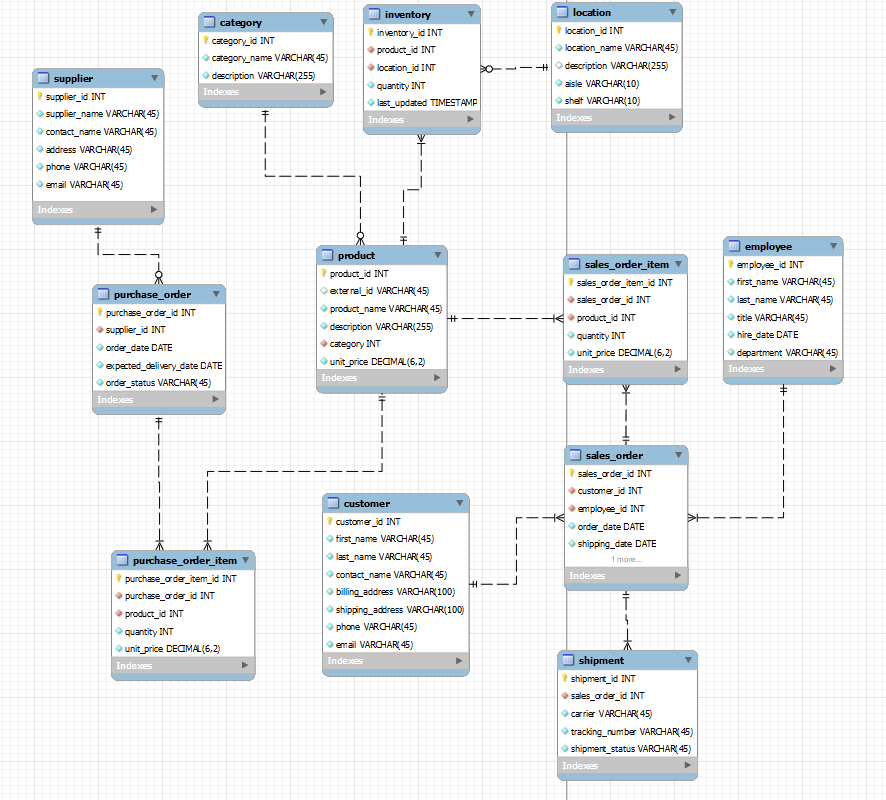

# warehouse_database
A monolithic warehouse database created in MySQL. I have provided a MySQL forward engineering script.

I have created views that are used often.
- A view showing all products with their categories
- A view showing stock information for all products
- A view showing total sales for each product
- A view showing all customers and their total orders

